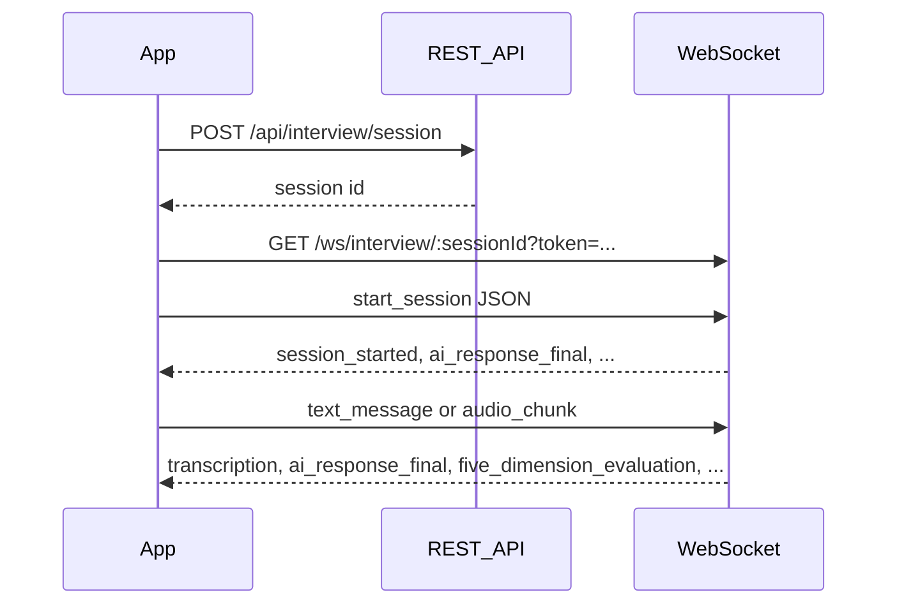

# 前后端协议（REST + WebSocket）

**别名 / 历史文件名：** 后台接入协议文档。

本文档为前后端对接的单一事实来源，描述 REST API 与 WebSocket 的格式、事件类型与数据体；实现以 `backend/internal/app/app.go` 路由注册、`backend/internal/ws/client.go` 与 `frontend/services/websocket.ts` 为准。

## 目录

- [1. REST API 协议](#1-rest-api-协议)
  - [1.1 认证相关接口](#11-认证相关接口)
  - [1.2 面试会话接口](#12-面试会话接口)
  - [1.3 问题库接口](#13-问题库接口)
  - [1.4 用户接口](#14-用户接口)
  - [1.5 健康检查与监控](#15-健康检查与监控)
- [2. WebSocket 协议](#2-websocket-协议)
  - [2.1 连接建立](#21-连接建立)
  - [2.2 消息格式与多行帧](#22-消息格式与多行帧)
  - [2.3 事件总览](#23-事件总览)
  - [2.4 客户端发送事件（载荷详情）](#24-客户端发送事件载荷详情)
  - [2.5 服务端推送事件（载荷详情）](#25-服务端推送事件载荷详情)
  - [2.6 前端类型与未实现事件](#26-前端类型与未实现事件)
- [3. 数据模型](#3-数据模型)
- [4. 认证机制](#4-认证机制)
- [5. 错误处理](#5-错误处理)

---

## 1. REST API 协议

基础路径: `/api`

所有请求和响应均使用 JSON 格式，Content-Type 为 `application/json`。

### 1.1 认证相关接口

#### 1.1.1 注册 (POST /api/auth/register)

**请求体:**
```json
{
  "email": "string (required, valid email)",
  "password": "string (required, min 6 chars)",
  "name": "string (required, min 1 char)"
}
```

**响应体 (201 Created):**
```json
{
  "success": true,
  "data": {
    "id": "string (UUID)",
    "email": "string",
    "name": "string",
    "avatar": "string (optional)",
    "subscriptionTier": "string (default: 'free')"
  }
}
```

#### 1.1.2 登录 (POST /api/auth/login)

**请求体:**
```json
{
  "email": "string (required, valid email)",
  "password": "string (required)"
}
```

**响应体 (200 OK):**
```json
{
  "success": true,
  "data": {
    "user": {
      "id": "string (UUID)",
      "email": "string",
      "name": "string",
      "avatar": "string (optional)",
      "subscriptionTier": "string"
    },
    "accessToken": "string (JWT)",
    "refreshToken": "string (JWT)",
    "expiresIn": "string (ISO 8601 format)"
  }
}
```

#### 1.1.3 刷新令牌 (POST /api/auth/refresh)

**请求体:**
```json
{
  "refreshToken": "string (required)"
}
```

**响应体 (200 OK):**
```json
{
  "success": true,
  "data": {
    "accessToken": "string (JWT)",
    "refreshToken": "string (JWT)"
  }
}
```

#### 1.1.4 登出 (POST /api/auth/logout)

**请求头:**
- `Authorization: Bearer <access_token>`

**响应体 (200 OK):**
```json
{
  "success": true,
  "data": {
    "message": "logged out successfully"
  }
}
```

### 1.2 面试会话接口

#### 1.2.1 获取场景列表 (GET /api/interview/scenarios)

无需认证，频率限制: 10 req/s

**响应体 (200 OK):**
```json
{
  "success": true,
  "data": [
    {
      "id": "string",
      "name": "string",
      "description": "string",
      "subScenarios": [
        {
          "id": "string",
          "name": "string",
          "description": "string"
        }
      ]
    }
  ]
}
```

#### 1.2.2 获取子场景详情 (GET /api/interview/scenarios/:id/:subId)

无需认证，频率限制: 10 req/s

**响应体 (200 OK):**
```json
{
  "success": true,
  "data": {
    "id": "string",
    "name": "string",
    "description": "string",
    "questionBank": [
      {
        "question": "string",
        "difficulty": "string",
        "keyPoints": ["string"],
        "sampleAnswer": "string"
      }
    ]
  }
}
```

#### 1.2.3 职位类型 (GET /api/interview/job-types)

无需认证，频率限制: 10 req/s

从配置 `interview/job_types.json` 返回可选职位类型。

**响应体 (200 OK):**
```json
{
  "success": true,
  "data": {
    "job_types": [
      {
        "id": "string",
        "name": "string",
        "name_zh": "string"
      }
    ]
  }
}
```

#### 1.2.4 面试官列表 (GET /api/interview/interviewers)

无需认证，频率限制: 10 req/s

从配置 `interview/interviewers.json` 返回可选面试官人设。

**响应体 (200 OK):**
```json
{
  "success": true,
  "data": {
    "interviewers": [
      {
        "id": "string",
        "name": "string",
        "title": "string",
        "avatar": "string",
        "description": "string",
        "preferred_scenarios": ["string"],
        "scoring_weights": { "dimension_key": 0.0 }
      }
    ]
  }
}
```

#### 1.2.5 创建会话 (POST /api/interview/session)

需要认证，频率限制: 5 req/s

**请求体:**
```json
{
  "scenarioType": "string (required)",
  "subScenario": "string (required)",
  "company": "string (optional)",
  "role": "string (optional)",
  "difficulty": "string (required, oneof: beginner|intermediate|advanced)",
  "aiCharacter": "string (optional)"
}
```

**响应体 (201 Created):**
```json
{
  "success": true,
  "data": {
    "id": "string (UUID)",
    "scenarioType": "string",
    "subScenario": "string",
    "company": "string",
    "role": "string",
    "difficulty": "string",
    "aiCharacter": "string",
    "status": "string (active|completed)",
    "startedAt": "string (ISO 8601)",
    "endedAt": "string (ISO 8601, optional)",
    "durationSeconds": "number",
    "overallScore": "number (optional)",
    "messageCount": "number",
    "createdAt": "string (ISO 8601)"
  }
}
```

#### 1.2.6 获取会话详情 (GET /api/interview/session/:id)

需要认证，频率限制: 5 req/s

**响应体 (200 OK):**
```json
{
  "success": true,
  "data": {
    "id": "string (UUID)",
    "scenarioType": "string",
    "subScenario": "string",
    "company": "string",
    "role": "string",
    "difficulty": "string",
    "aiCharacter": "string",
    "status": "string",
    "startedAt": "string (ISO 8601)",
    "endedAt": "string (ISO 8601, optional)",
    "durationSeconds": "number",
    "overallScore": "number (optional)",
    "messageCount": "number",
    "createdAt": "string (ISO 8601)"
  }
}
```

#### 1.2.7 结束会话 (POST /api/interview/session/:id/end)

需要认证，频率限制: 5 req/s

**响应体 (200 OK):**
```json
{
  "success": true,
  "data": {
    "id": "string (UUID)",
    "status": "completed",
    "endedAt": "string (ISO 8601)",
    "durationSeconds": "number",
    "overallScore": "number"
  }
}
```

#### 1.2.8 获取会话反馈 (GET /api/interview/session/:id/feedback)

需要认证，频率限制: 5 req/s

**响应体 (200 OK):**
```json
{
  "success": true,
  "data": {
    "id": "string (UUID)",
    "session_id": "string (UUID)",
    "pronunciation_score": "number (0-10)",
    "fluency_score": "number (0-10)",
    "grammar_score": "number (0-10)",
    "vocabulary_score": "number (0-10)",
    "content_score": "number (0-10)",
    "overall_score": "number (0-10)",
    "strengths": "string (JSON array)",
    "improvements": "string (JSON array)",
    "full_transcript": "string",
    "detailed_analysis": "string (JSON)",
    "created_at": "string (ISO 8601)"
  }
}
```

#### 1.2.9 获取用户历史会话 (GET /api/user/history)

需要认证，频率限制: 5 req/s

**查询参数:**
- `page`: 页码 (默认: 1)
- `pageSize`: 每页数量 (默认: 20)

**响应体 (200 OK):**
```json
{
  "success": true,
  "data": {
    "sessions": [
      {
        "id": "string (UUID)",
        "scenarioType": "string",
        "subScenario": "string",
        "company": "string",
        "role": "string",
        "difficulty": "string",
        "aiCharacter": "string",
        "status": "string",
        "startedAt": "string (ISO 8601)",
        "endedAt": "string (ISO 8601, optional)",
        "durationSeconds": "number",
        "overallScore": "number (optional)",
        "messageCount": "number",
        "createdAt": "string (ISO 8601)"
      }
    ],
    "total": "number",
    "page": "number"
  }
}
```

### 1.3 问题库接口

#### 1.3.1 列出问题 (GET /api/questions)

频率限制: 10 req/s

**查询参数:**
- `category`: 分类 (可选)
- `difficulty`: 难度 (可选)
- `limit`: 数量限制 (可选)

**响应体 (200 OK):**
```json
{
  "success": true,
  "data": [
    {
      "id": "string (UUID)",
      "category": "string",
      "subCategory": "string",
      "question": "string",
      "keyPoints": ["string"],
      "commonMistakes": ["string"],
      "sampleAnswer": "string",
      "difficulty": "string",
      "isActive": "boolean"
    }
  ]
}
```

#### 1.3.2 获取随机问题 (GET /api/questions/random)

频率限制: 10 req/s

**响应体 (200 OK):**
```json
{
  "success": true,
  "data": {
    "id": "string (UUID)",
    "category": "string",
    "subCategory": "string",
    "question": "string",
    "difficulty": "string"
  }
}
```

#### 1.3.3 获取分类列表 (GET /api/questions/categories)

频率限制: 10 req/s

**响应体 (200 OK):**
```json
{
  "success": true,
  "data": ["string"]
}
```

### 1.4 用户接口

#### 1.4.1 获取用户资料 (GET /api/user/profile)

需要认证，频率限制: 5 req/s

**响应体 (200 OK):**
```json
{
  "success": true,
  "data": {
    "id": "string (UUID)",
    "email": "string",
    "name": "string",
    "avatar": "string (optional)",
    "subscriptionTier": "string",
    "settings": "object (optional)"
  }
}
```

#### 1.4.2 更新用户资料 (PUT /api/user/profile)

需要认证，频率限制: 5 req/s

**请求体:**
```json
{
  "name": "string (optional)",
  "avatar": "string (optional)",
  "settings": "object (optional)"
}
```

**响应体 (200 OK):**
```json
{
  "success": true,
  "data": {
    "id": "string (UUID)",
    "email": "string",
    "name": "string",
    "avatar": "string",
    "subscriptionTier": "string"
  }
}
```

#### 1.4.3 修改密码 (POST /api/user/change-password)

需要认证，频率限制: 5 req/s

**请求体:**
```json
{
  "currentPassword": "string (required)",
  "newPassword": "string (required, min 6 chars)"
}
```

**响应体 (200 OK):**
```json
{
  "success": true,
  "data": {
    "message": "password updated successfully"
  }
}
```

### 1.5 健康检查与监控

#### 1.5.1 存活检查 (GET /healthz)

无需认证

**响应体 (200 OK):**
```json
{
  "status": "ok"
}
```

#### 1.5.2 就绪检查 (GET /readyz)

无需认证

**响应体 (200 OK):**
```json
{
  "status": "ready"
}
```

#### 1.5.3 活跃会话数 (GET /ws/status)

无需认证

**响应体 (200 OK):**
```json
{
  "active_sessions": "number"
}
```

#### 1.5.4 AI 模型状态 (GET /api/ai/status)

无需认证。返回当前模型提供方名称；若提供方为 `qwen_local`，会尝试请求本地 llama-server 的 `/health` 与 `/props`（环境变量 `QWEN_LOCAL_URL`，默认自 `http://localhost:8082/completion` 推导 base URL）。

**响应体 (200 OK):**
```json
{
  "success": true,
  "data": {
    "provider": "string",
    "timestamp": 0,
    "llama_server_health": {},
    "llama_server_props": {}
  }
}
```

`llama_server_*` 字段仅在 `qwen_local` 且探测成功时出现。

#### 1.5.5 Prometheus 指标 (GET /metrics)

无需认证，返回 Prometheus 格式的指标数据

---

## 2. WebSocket 协议

WebSocket 用于实时面试交互，支持双向通信。

### 2.1 连接建立

**端点:** `GET /ws/interview/:sessionId`

**认证方式:** 通过以下任一方式传递 JWT Token:
1. Query 参数: `?token=<access_token>`
2. Authorization 头: `Bearer <access_token>`
3. Sec-WebSocket-Protocol 头: `<access_token>`

**连接 URL 示例:**
```
ws://localhost:8080/ws/interview/{sessionId}?token={access_token}
```

典型顺序（REST 建会话后再连 WS）：



### 2.2 消息格式与多行帧

所有 WebSocket 消息为 **JSON**，统一外壳如下（与 `backend/internal/ws/client.go` 中 `WSMessage` 一致）：

```typescript
interface WSMessage {
  session_id: string;      // 会话 UUID
  event_id: number;        // 事件序列号（服务端递增分配）
  turn_id?: string;        // 轮次 UUID（部分事件）
  event_type: string;      // 事件类型
  data: unknown;           // 事件数据体
  timestamp: string;       // ISO 8601 时间戳（服务端发出时填充）
}
```

**单帧多行 JSON：** 服务端 `WritePump` 在批量写回时，可能将多条 JSON 用换行符 `\n` 拼在同一 WebSocket **文本帧**内。客户端**必须**按 `\n` 分割后再对每一行做 `JSON.parse`（见 `frontend/services/websocket.ts`）。

### 2.3 事件总览

**客户端 → 服务端（C→S）** — `handleMessage` 仅识别下列 `event_type`：

| event_type | 说明 |
|------------|------|
| `start_session` | 连接成功后启动会话上下文，并触发首题等逻辑 |
| `text_message` | 用户文本作答 |
| `audio_chunk` | Base64 音频；可走 STT 或仅缓存发音评测 |
| `interrupt` | 打断 |
| `end_session` | 结束会话并异步生成总结反馈 |
| `heartbeat` | 应用层保活 |

**服务端 → 客户端（S→C）** — 当前 `client.go` 会发送：

| event_type | 说明 |
|------------|------|
| `session_started` | 会话已就绪 |
| `typing_indicator` | AI 正在输入（首题前等） |
| `ai_response_final` | 完整 AI 文本（`data.content`，`data.type` 如 `question`） |
| `audio_received` | 已收到音频并开始处理 |
| `transcription` | 用户作答转写（`turn_id` + `data.text`） |
| `five_dimension_evaluation` | 五维评分与反馈 |
| `audio_response` | TTS：`data.audio`（Base64）、`data.format`（当前实现为 `wav`） |
| `feedback_ready` | 会话总结反馈已写入，可拉 REST；`data` 为 `Feedback` 模型 JSON |
| `session_ended` | 会话结束确认 |
| `heartbeat_ack` | `data.server_time` 为毫秒 Unix 时间戳 |
| `interrupted` | 打断确认 |
| `error` | `data.code` / `data.message`（部分错误仅有 `message`） |

### 2.4 客户端发送事件（载荷详情）

#### 2.4.1 开始会话 (`start_session`)

**推荐载荷（与 REST `POST /api/interview/session` 体字段一致，便于服务端出题与题库一致）：**

```json
{
  "event_type": "start_session",
  "session_id": "string (UUID)",
  "data": {
    "scenarioType": "string",
    "subScenario": "string",
    "company": "string",
    "role": "string",
    "difficulty": "string",
    "aiCharacter": "string"
  }
}
```

**当前 App 实际行为：** `frontend/services/websocket.ts` 在 `onopen` 时仅发送 `{ "event_type": "start_session", "session_id": "<id>" }`，**未带 `data`**。后端仍从 `data` 读取场景字段，缺省为空字符串，可能与 REST 已持久化的会话信息不一致。**建议后续由前端补全 `data`，或后端按 `session_id` 从数据库补全场景。**

#### 2.4.2 文本消息 (`text_message`)

```json
{
  "event_type": "text_message",
  "data": {
    "content": "string",
    "inputMode": "text | voice"
  }
}
```

`inputMode` 可选，缺省为 `text`；用于消息持久化与统计（语音转写后提交也会带 `voice`）。

#### 2.4.3 音频片段 (`audio_chunk`)

```json
{
  "event_type": "audio_chunk",
  "data": {
    "audio": "string (base64, DataURL 去掉前缀后的部分)",
    "format": "webm | mp4 | ogg | wav 等",
    "pronunciation_only": false
  }
}
```

- `pronunciation_only: true`：浏览器侧已完成语音转文字时，仅上传音频供发音评测，**跳过后端 STT**。
- 过短音频可能被拒绝并收到 `error`（如 `AUDIO_TOO_SHORT`）。

#### 2.4.4 其他 C→S

`interrupt`、`end_session`、`heartbeat` 与下述最小体一致即可；`session_id` 在客户端实现中可随其它字段一并发送。

```json
{ "event_type": "interrupt" }
```

```json
{ "event_type": "end_session" }
```

```json
{ "event_type": "heartbeat" }
```

### 2.5 服务端推送事件（载荷详情）

下列示例为**完整 `WSMessage` 行**（含 `session_id` / `event_id` / `timestamp` 等字段时以实际为准）。

#### `session_started`

```json
{
  "event_type": "session_started",
  "data": { "status": "active" }
}
```

#### `typing_indicator`

```json
{
  "event_type": "typing_indicator",
  "data": { "is_typing": true }
}
```

#### `ai_response_final`

```json
{
  "event_type": "ai_response_final",
  "data": {
    "content": "string",
    "type": "question | answer | feedback"
  }
}
```

#### `audio_received`

```json
{
  "event_type": "audio_received",
  "data": { "status": "processing" }
}
```

#### `transcription`

```json
{
  "event_type": "transcription",
  "turn_id": "string (UUID)",
  "data": { "text": "string" }
}
```

#### `five_dimension_evaluation`

结构与 LLM 返回一致，字段包括但不限于 `overall_score`、`dimensions`（发音/流利/语法/词汇/内容）、`overall_feedback`、`interview_tips`、`next_practice_suggestions` 等。

#### `audio_response`

```json
{
  "event_type": "audio_response",
  "data": {
    "audio": "string (base64)",
    "format": "wav"
  }
}
```

#### `feedback_ready`

`data` 为会话总结反馈对象（与 REST `GET /api/interview/session/:id/feedback` 对应模型序列化字段一致，如各维度分数、`strengths`、`improvements` 等）。

#### `session_ended` / `heartbeat_ack` / `interrupted`

```json
{ "event_type": "session_ended", "data": { "status": "completed" } }
```

```json
{ "event_type": "heartbeat_ack", "data": { "server_time": 0 } }
```

```json
{ "event_type": "interrupted", "data": { "status": "interrupted" } }
```

#### `error`

```json
{
  "event_type": "error",
  "data": {
    "code": "RATE_LIMIT | AUDIO_TOO_SHORT | STT_FAILED | STT_TOO_QUIET | STT_NO_SPEECH | STT_EMPTY | ...",
    "message": "string"
  }
}
```

仅文案类错误可能只有 `message`（无 `code`）。

**常见 `code` 含义：**

| code | 说明 |
|------|------|
| `RATE_LIMIT` | 上一轮流式评估未完成，拒绝新的文本/音频作答 |
| `AUDIO_TOO_SHORT` | 音频过短，无法做有效 STT |
| `STT_FAILED` | 语音转写失败 |
| `STT_TOO_QUIET` | 音量过低或未检测到有效人声 |
| `STT_NO_SPEECH` | 未检测到语音内容 |
| `STT_EMPTY` | 转写结果为空 |

### 2.6 前端类型与未实现事件

`frontend/services/websocket.ts` 中 `WSEventType` 另包含 `message_received`、`evaluation`、`ai_response_partial`、`quick_evaluation`、`quick_evaluation_partial`、`five_dimension_evaluation_partial`、`pronunciation_feedback` 等。**当前后端 `client.go` 未发送上述事件**；发音相关结果合并进 `five_dimension_evaluation`（及会话总结 REST）。保留类型可用于兼容旧代码或 `onMessage` 默认分支，新建集成应以 §2.3 S→C 表为准。

---

## 3. 数据模型

### 3.1 用户 (User)

```typescript
interface User {
  id: string;              // UUID
  email: string;
  passwordHash: string;    // 不返回给前端
  name: string;
  avatar?: string;
  subscriptionTier: string; // default: 'free'
  settings?: object;       // JSON
  createdAt: string;
  updatedAt: string;
}
```

### 3.2 面试会话 (InterviewSession)

```typescript
interface InterviewSession {
  id: string;              // UUID
  userId: string;          // UUID
  scenarioType: string;
  subScenario: string;
  company?: string;
  role?: string;
  difficulty: string;      // beginner|intermediate|advanced
  aiCharacter?: string;
  status: string;          // active|completed
  startedAt: string;
  endedAt?: string;
  durationSeconds: number;
  overallScore?: number;
  promptVersion?: string;
  modelVersion?: string;
  messages: Message[];
  feedback?: Feedback;
  createdAt: string;
  updatedAt: string;
}
```

### 3.3 消息 (Message)

```typescript
interface Message {
  id: string;              // UUID
  sessionId: string;       // UUID
  role: string;            // user|ai
  content: string;
  audioUrl?: string;
  transcription?: string;
  pronunciationScore?: number;
  sequenceNo: number;
  turnId?: string;         // UUID
  createdAt: string;
}
```

### 3.4 反馈 (Feedback)

```typescript
interface Feedback {
  id: string;              // UUID
  sessionId: string;       // UUID
  pronunciationScore: number; // 0-10
  fluencyScore: number;    // 0-10
  grammarScore: number;    // 0-10
  vocabularyScore: number; // 0-10
  contentScore: number;    // 0-10
  overallScore: number;    // 0-10
  strengths: string[];     // JSON 数组
  improvements: string[];  // JSON 数组
  fullTranscript: string;
  detailedAnalysis?: object; // JSON
  createdAt: string;
}
```

### 3.5 问题库 (QuestionBank)

```typescript
interface QuestionBank {
  id: string;              // UUID
  category: string;
  subCategory?: string;
  question: string;
  keyPoints?: string[];    // JSON 数组
  commonMistakes?: string[]; // JSON 数组
  sampleAnswer: string;
  difficulty: string;      // beginner|intermediate|advanced
  isActive: boolean;
  createdAt: string;
  updatedAt: string;
}
```

---

## 4. 认证机制

### 4.1 JWT 令牌

系统使用 JWT (JSON Web Token) 进行身份认证，包含两种令牌:

- **Access Token**: 短期有效，用于 API 请求认证
- **Refresh Token**: 长期有效，用于刷新 Access Token

### 4.2 令牌传递方式

#### REST API:
```
Authorization: Bearer <access_token>
```

#### WebSocket:
1. Query 参数: `?token=<access_token>`
2. Authorization 头: `Bearer <access_token>`
3. Sec-WebSocket-Protocol 头: `<access_token>`

### 4.3 令牌刷新流程

当 Access Token 过期（401 Unauthorized）时:

1. 客户端使用 Refresh Token 调用 `POST /api/auth/refresh`
2. 获取新的 Access Token 和 Refresh Token
3. 使用新令牌重试原请求

### 4.4 频率限制

- **认证接口**: 5 req/s，burst 10
- **只读接口**: 10 req/s，burst 20
- **写操作接口**: 5 req/s，burst 10
- **WebSocket**: 无频率限制（已有 isEvaluating 守卫）

---

## 5. 错误处理

### 5.1 HTTP 错误响应格式

```json
{
  "success": false,
  "error": "string (error message)"
}
```

### 5.2 常见 HTTP 状态码

- `400 Bad Request`: 请求参数错误
- `401 Unauthorized`: 未认证或令牌无效/过期
- `403 Forbidden`: 权限不足
- `404 Not Found`: 资源不存在
- `429 Too Many Requests`: 超过频率限制
- `500 Internal Server Error`: 服务器内部错误

### 5.3 WebSocket 错误处理

WebSocket 错误通过 `event_type: "error"` 事件推送（`data` 可能含 `code` 与 `message`，或仅 `message`）:

```json
{
  "event_type": "error",
  "data": {
    "code": "RATE_LIMIT",
    "message": "Please wait for the current evaluation to complete before submitting a new answer"
  }
}
```

`RATE_LIMIT`、`AUDIO_TOO_SHORT`、`STT_*` 等代码含义见 [§2.5 服务端推送事件](#25-服务端推送事件载荷详情) 中 `error` 小节。

### 5.4 重连机制

前端 `frontend/services/websocket.ts` 自动重连（非主动 `close(1000)` 时）：

- **最大重连次数:** 15 次（达到后触发 `onError`，不再重试）
- **退避:** 指数退避 `min(30000ms, 1000ms × 2^(attempt-1))`，并加 0–399ms 随机抖动
- **恢复:** 重连成功后再次 `connect` 会执行与首次连接相同的 `onopen` 逻辑（含发送 `start_session`）

### 5.5 心跳保活

- **应用层心跳（客户端）:** 约每 **25 秒**（`HEARTBEAT_INTERVAL_MS = 25000`）发送 `event_type: "heartbeat"`
- **服务端:** 回复 `heartbeat_ack`，`data.server_time` 为毫秒级 Unix 时间戳
- **传输层:** 服务端按 gorilla/websocket 约定发送 **Ping**；读超时约 **60 秒**（`pongWait`），任意入站消息会刷新读超时

---

## 附录

### A. 场景类型

- `interview`: 面试模拟
- `networking`: 社交网络
- `presentation`: 演讲演示
- `difficult_conversation`: 困难对话
- `workplace`: 职场沟通
- `cross_cultural`: 跨文化交流

### B. 难度级别

- `beginner`: 初级
- `intermediate`: 中级
- `advanced`: 高级

### C. AI 角色

可配置的 AI 面试官角色，如:
- `professional`: 专业面试官
- `friendly`: 友好面试官
- `strict`: 严格面试官

### D. 音频格式

支持的音频格式:
- `webm`: WebM 格式（前端录音默认）
- `pcm`: 原始 PCM 数据

---

**文档版本**: 1.1  
**最后更新**: 2026-04-21  
**维护者**: 开发团队