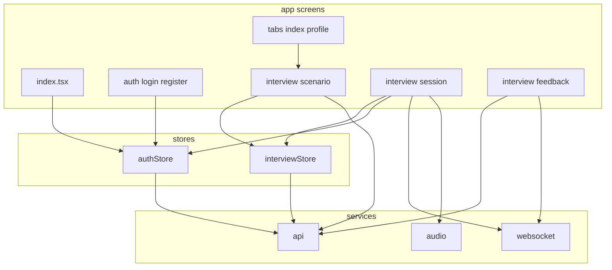

# 前端功能设计与代码架构文档

本文档详细分析了 InterviewPro 前端应用的功能设计、代码架构、技术选型和实现细节。

## 目录

- [1. 项目概述](#1-项目概述)
  - [1.1 应用简介](#11-应用简介)
  - [1.2 核心功能](#12-核心功能)
  - [1.3 技术栈](#13-技术栈)
- [2. 架构设计](#2-架构设计)
  - [2.1 整体架构](#21-整体架构)
  - [2.2 目录结构](#22-目录结构)
  - [2.3 数据流架构](#23-数据流架构)
- [3. 路由与导航设计](#3-路由与导航设计)
  - [3.1 路由结构](#31-路由结构)
  - [3.2 导航流程](#32-导航流程)
  - [3.3 路由守卫](#33-路由守卫)
- [4. 状态管理](#4-状态管理)
  - [4.1 Zustand Store 设计](#41-zustand-store-设计)
  - [4.2 认证状态管理](#42-认证状态管理)
  - [4.3 面试状态管理](#43-面试状态管理)
- [5. 核心功能模块](#5-核心功能模块)
  - [5.1 认证模块](#51-认证模块)
  - [5.2 场景选择模块](#52-场景选择模块)
  - [5.3 面试会话模块](#53-面试会话模块)
  - [5.4 反馈展示模块](#54-反馈展示模块)
  - [5.5 个人中心模块](#55-个人中心模块)
- [6. 服务层设计](#6-服务层设计)
  - [6.1 HTTP API 客户端](#61-http-api-客户端)
  - [6.2 WebSocket 服务](#62-websocket-服务)
  - [6.3 音频服务](#63-音频服务)
- [7. 组件设计](#7-组件设计)
  - [7.1 组件分类](#71-组件分类)
  - [7.2 核心组件详解](#72-核心组件详解)
  - [7.3 组件通信模式](#73-组件通信模式)
- [8. 类型系统](#8-类型系统)
  - [8.1 类型定义](#81-类型定义)
  - [8.2 接口设计](#82-接口设计)
- [9. 跨平台适配](#9-跨平台适配)
  - [9.1 平台检测](#91-平台检测)
  - [9.2 音频服务适配](#92-音频服务适配)
  - [9.3 UI 适配](#93-ui-适配)
- [10. 性能优化](#10-性能优化)
  - [10.1 渲染优化](#101-渲染优化)
  - [10.2 网络优化](#102-网络优化)
  - [10.3 状态优化](#103-状态优化)
- [11. 错误处理与用户体验](#11-错误处理与用户体验)
  - [11.1 错误边界](#111-错误边界)
  - [11.2 加载状态](#112-加载状态)
  - [11.3 重试机制](#113-重试机制)
- [12. 测试策略](#12-测试策略)
  - [12.1 E2E 测试](#121-e2e-测试)
  - [12.2 测试工具链](#122-测试工具链)
- [13. 设计模式与最佳实践](#13-设计模式与最佳实践)
  - [13.1 使用的设计模式](#131-使用的设计模式)
  - [13.2 代码规范](#132-代码规范)
  - [13.3 改进建议](#133-改进建议)

---

## 1. 项目概述

### 1.1 应用简介

InterviewPro 是一款 AI 驱动的英语面试练习应用，支持多场景模拟、实时语音交互、智能评估反馈等功能。应用采用 React Native + Expo 构建，支持 Web、iOS、Android 三端运行。

**核心特点：**
- 🎯 6 大练习场景，30+ 子场景
- 🤖 AI 面试官实时对话
- 🎤 语音录制与实时转录
- 📊 五维评分体系（发音、流利度、语法、词汇、内容）
- 🔄 实时 WebSocket 通信
- 📱 跨平台支持（Web/iOS/Android）

### 1.2 核心功能

1. **用户认证**：注册、登录、令牌刷新、会话恢复
2. **场景选择**：6 大场景、子场景、公司、职位、难度、AI 角色
3. **实时面试**：文本/语音对话、AI 实时响应、打字指示器
4. **智能评估**：五维评分、优势分析、改进建议、示例回答
5. **反馈查看**：详细评分、完整记录、面试技巧
6. **历史记录**：练习历史、统计信息、成绩追踪
7. **音频处理**：录音、播放、实时 STT（Web Speech API）

### 1.3 技术栈

**核心框架：**
- React Native 0.81.5
- Expo SDK 54.0.33
- React 19.1.0
- TypeScript 5.9.2

**路由与导航：**
- Expo Router 6.0.23（基于文件的路由）

**状态管理：**
- Zustand 5.0.12（轻量级状态管理）

**网络通信：**
- Axios 1.15.0（HTTP 客户端）
- WebSocket（实时通信）
- Socket.io-client 4.8.3（备用）

**UI 组件：**
- React Native Paper 5.15.0（Material Design 组件库）
- React Native Reanimated 4.1.1（动画）
- React Native Safe Area Context 5.6.0（安全区域）
- React Native Screens 4.16.0（原生屏幕优化）

**音频处理：**
- Expo Audio 1.1.1（原生平台）
- Web Speech API（Web 平台 STT）
- MediaRecorder API（Web 平台录音）

**存储：**
- Async Storage 2.2.0（本地持久化）
- Expo Secure Store 15.0.8（安全存储）

**开发工具：**
- Playwright 1.59.1（E2E 测试）
- Babel Preset Expo 54.0.10

---

## 2. 架构设计

### 2.1 整体架构

应用采用 **分层架构 + 功能模块化** 设计：

```
┌─────────────────────────────────────────┐
│         Presentation Layer              │
│  (app/ 路由页面 + components/ 组件)      │
├─────────────────────────────────────────┤
│         State Management Layer          │
│       (stores/ Zustand Stores)          │
├─────────────────────────────────────────┤
│         Service Layer                   │
│   (services/ API、WS、Audio 服务)        │
├─────────────────────────────────────────┤
│         Constants & Types Layer         │
│  (constants/ types/ 配置与类型定义)       │
└─────────────────────────────────────────┘
```

**架构原则：**
1. **单向数据流**：UI → Actions → Store → Services → API → Store → UI
2. **关注点分离**：路由页面负责 UI 展示，Store 管理状态，Services 处理业务逻辑
3. **平台抽象**：音频服务通过接口抽象，实现平台特定逻辑
4. **类型安全**：全量 TypeScript，严格类型检查

### 2.2 目录结构

```
frontend/
├── app/                          # 路由页面（Expo Router 基于文件的路由）
│   ├── _layout.tsx               # 根布局（SafeAreaProvider + PaperProvider）
│   ├── index.tsx                 # 入口页面（认证检查 + 重定向）
│   ├── (auth)/                   # 认证路由组（无 Tab 栏）
│   │   ├── _layout.tsx
│   │   ├── login.tsx             # 登录页
│   │   └── register.tsx          # 注册页
│   ├── (tabs)/                   # 主 Tab 路由组
│   │   ├── _layout.tsx           # Tab 布局（首页 + 我的）
│   │   ├── index.tsx             # 首页（场景选择网格）
│   │   └── profile.tsx           # 个人中心（历史 + 统计）
│   └── interview/                # 面试路由组
│       ├── [scenario].tsx        # 场景详情页（配置参数）
│       ├── session.tsx           # 面试会话页（实时对话）
│       └── feedback.tsx          # 反馈页（评估结果）
│
├── components/                   # 可复用组件
│   ├── scenario/
│   │   └── ScenarioCard.tsx      # 场景卡片组件
│   ├── ScoreCard.tsx             # 内联评分卡片（聊天中显示）
│   ├── FiveDimensionScore.tsx    # 五维评分详情组件
│   ├── chat/                     # （空，待实现）
│   ├── feedback/                 # （空，待实现）
│   ├── profile/                  # （空，待实现）
│   └── ui/                       # （空，待实现）
│
├── services/                     # 服务层
│   ├── api.ts                    # HTTP API 客户端（Axios）
│   ├── websocket.ts              # WebSocket 实时通信服务
│   └── audio.ts                  # 音频服务（跨平台抽象）
│
├── stores/                       # 状态管理（Zustand）
│   ├── authStore.ts              # 认证状态（用户、令牌、登录/登出）
│   └── interviewStore.ts         # 面试状态（会话、配置选项）
│
├── types/                        # TypeScript 类型定义
│   ├── interview.ts              # 面试相关类型（场景、会话、消息）
│   └── user.ts                   # 用户相关类型（User、AuthState）
│
├── constants/                    # 常量配置
│   ├── api.ts                    # API 端点、超时、基础 URL
│   ├── colors.ts                 # 颜色主题
│   └── scenarios.ts              # 场景数据、AI 角色、公司列表
│
├── hooks/                        # 自定义 Hooks
│   ├── useFrameworkReady.ts      # 框架就绪检测（隐藏启动屏）
│   └── useVoiceRecorder.ts       # 语音录制 Hook
│
├── e2e/                          # Playwright E2E 测试
├── assets/                       # 静态资源（图标、启动图）
├── utils/                        # （空，待实现）
├── package.json
├── app.json                      # Expo 配置
├── tsconfig.json
└── playwright.config.ts
```

### 2.3 数据流架构

**认证流程数据流：**
```
用户输入 → login.tsx
  ↓
useAuthStore.login()
  ↓
api.post('/api/auth/login')
  ↓
保存令牌到 AsyncStorage
  ↓
更新 Store 状态（user, token, isAuthenticated）
  ↓
router.replace('/(tabs)')
```

**面试会话数据流：**
```
场景选择 → [scenario].tsx
  ↓
useInterviewStore.createSession()
  ↓
api.post('/api/interview/session')
  ↓
获取 sessionId → router.push('/interview/session')
  ↓
wsService.connect(sessionId, token)
  ↓
发送 start_session 事件
  ↓
接收 AI 问题 → 显示在聊天界面
  ↓
用户回答（文本/语音）
  ↓
wsService.sendMessage() / sendAudioChunk()
  ↓
接收评估结果 → 显示 ScoreCard
  ↓
循环下一题...
```

**反馈加载数据流：**
```
session.tsx 结束会话
  ↓
router.push('/interview/feedback?sessionId=xxx')
  ↓
feedback.tsx 挂载
  ↓
api.get('/api/interview/session/:id/feedback')
  ↓
404？→ 重试（最多 30 次，间隔 2 秒）
  ↓
获取反馈数据 → 解析 JSON 字段
  ↓
渲染 FiveDimensionScore 组件
```

---

## 3. 路由与导航设计

### 3.1 路由结构

应用使用 **Expo Router** 实现基于文件的路由系统，采用路由组（Route Groups）组织页面。

**路由树：**
```
/ (index.tsx)
  ├─ 认证检查
  │   ├─ 已认证 → /(tabs)
  │   └─ 未认证 → /(auth)/login
  │
├─ /(auth)/               # 认证路由组（无 Tab 栏）
│   ├─ /login
│   └─ /register
│
├─ /(tabs)/               # 主 Tab 路由组
│   ├─ / (首页)
│   └─ /profile (我的)
│
└─ /interview/            # 面试路由组
    ├─ /[scenario]        # 场景详情（动态路由）
    ├─ /session           # 面试会话
    └─ /feedback          # 反馈页面
```

**路由配置：**

```typescript
// app/_layout.tsx
export default function RootLayout() {
  return (
    <SafeAreaProvider>
      <PaperProvider>
        <Stack screenOptions={{ headerShown: false }}>
          <Stack.Screen name="(tabs)" />
          <Stack.Screen name="(auth)" />
          <Stack.Screen name="interview/[scenario]" options={{ presentation: "card" }} />
          <Stack.Screen name="interview/session" options={{ presentation: "card" }} />
          <Stack.Screen name="interview/feedback" options={{ presentation: "card" }} />
        </Stack>
      </PaperProvider>
    </SafeAreaProvider>
  );
}
```

### 3.2 导航流程

**主要导航路径：**

1. **应用启动流程：**
   ```
   index.tsx → 检查认证状态
     ├─ 有 token → /(tabs)
     └─ 无 token → /(auth)/login
   ```

2. **开始面试流程：**
   ```
   /(tabs)/index.tsx (首页)
     ↓ 点击场景卡片
   /interview/[scenario] (场景详情)
     ↓ 配置参数 + 点击"开始练习"
   /interview/session (面试会话)
     ↓ 结束会话
   /interview/feedback (反馈页面)
   ```

3. **导航 API 使用：**
   - `router.push()`: 压入新页面（可返回）
   - `router.replace()`: 替换当前页面（不可返回）
   - `router.back()`: 返回上一页
   - `router.push({ pathname, params })`: 带参数导航

**示例：**
```typescript
// 带参数导航
router.push({
  pathname: "/interview/[scenario]",
  params: { scenario: scenario.id },
});

// 替换导航（登录成功后）
router.replace("/(tabs)");
```

### 3.3 路由守卫

**认证守卫（index.tsx）：**
```typescript
export default function Index() {
  const { isAuthenticated, token, restoreSession } = useAuthStore();
  const [checking, setChecking] = useState(true);

  useEffect(() => {
    const restore = async () => {
      await restoreSession();  // 从 AsyncStorage 恢复会话
      setChecking(false);
    };
    restore();
  }, []);

  if (checking) {
    return <LoadingSpinner />;  // 检查中显示加载
  }

  if (isAuthenticated || token) {
    return <Redirect href="/(tabs)" />;  // 已认证重定向到主页
  }

  return <Redirect href="/(auth)/login" />;  // 未认证重定向到登录
}
```

**特点：**
- 应用启动时自动恢复会话（从 AsyncStorage 读取 token）
- 根据认证状态自动重定向
- 显示加载状态避免闪烁

---

## 4. 状态管理

### 4.1 Zustand Store 设计

应用使用 **Zustand** 进行状态管理，采用以下设计原则：

1. **按功能拆分 Store**：authStore（认证）、interviewStore（面试）
2. **扁平化状态**：避免深层嵌套，便于更新
3. **动作封装**：状态更新逻辑封装在 Store 内部
4. **异步操作**：API 调用在 Store actions 中处理

**Store 结构模式：**
```typescript
interface StoreState {
  // 状态字段
  data: Type | null;
  isLoading: boolean;
  
  // 同步动作
  setData: (data: Type) => void;
  setLoading: (loading: boolean) => void;
  
  // 异步动作
  fetchData: () => Promise<void>;
}

export const useStore = create<StoreState>((set, get) => ({
  data: null,
  isLoading: false,
  
  setData: (data) => set({ data }),
  setLoading: (loading) => set({ isLoading: loading }),
  
  fetchData: async () => {
    set({ isLoading: true });
    try {
      const result = await api.get('/endpoint');
      set({ data: result });
    } catch (error) {
      throw error;
    } finally {
      set({ isLoading: false });
    }
  },
}));
```

### 4.2 认证状态管理

**authStore.ts 完整设计：**

```typescript
interface AuthState {
  // 状态
  user: User | null;
  token: string | null;
  refreshToken: string | null;
  isAuthenticated: boolean;
  isLoading: boolean;
  
  // 认证动作
  login: (email, password) => Promise<void>;
  register: (email, password, name) => Promise<void>;
  logout: () => Promise<void>;
  refreshSession: () => Promise<void>;
  
  // 状态操作
  setUser: (user: User) => void;
  setTokens: (tokens: TokenPair) => void;
  clearSession: () => void;
  setLoading: (loading: boolean) => void;
  restoreSession: () => Promise<void>;
}
```

**核心功能：**

1. **登录：**
   ```typescript
   login: async (email, password) => {
     set({ isLoading: true });
     try {
       const data = await api.post(ENDPOINTS.LOGIN, { email, password });
       await api.saveTokens(data.accessToken, data.refreshToken);
       set({
         user: data.user,
         token: data.accessToken,
         refreshToken: data.refreshToken,
         isAuthenticated: true,
         isLoading: false,
       });
     } catch (error) {
       set({ isLoading: false });
       throw error;
     }
   }
   ```

2. **注册后自动登录：**
   ```typescript
   register: async (email, password, name) => {
     set({ isLoading: true });
     try {
       await api.post(ENDPOINTS.REGISTER, { email, password, name });
       await get().login(email, password);  // 注册成功后自动登录
     } catch (error) {
       set({ isLoading: false });
       throw error;
     }
   }
   ```

3. **会话恢复：**
   ```typescript
   restoreSession: async () => {
     const [token, refreshToken] = await AsyncStorage.multiGet([
       "access_token",
       "refresh_token",
     ]);
     if (token[1] && refreshToken[1]) {
       set({
         token: token[1],
         refreshToken: refreshToken[1],
         isAuthenticated: true,
       });
     }
   }
   ```

4. **登出：**
   ```typescript
   logout: async () => {
     try {
       await api.post(ENDPOINTS.LOGOUT);  // 调用后端登出
     } finally {
       get().clearSession();  // 无论成功失败都清理本地会话
     }
   }
   ```

### 4.3 面试状态管理

**interviewStore.ts 设计：**

```typescript
interface InterviewState {
  // 会话状态
  currentSession: InterviewSession | null;
  isSessionActive: boolean;
  isLoading: boolean;
  
  // 选择状态（场景配置）
  selectedScenario: ScenarioType | null;
  selectedSubScenario: SubScenario | null;
  selectedCompany: string | null;
  selectedRole: string;
  selectedDifficulty: Difficulty;
  selectedAICharacter: string | null;
  
  // 会话动作
  createSession: (request) => Promise<InterviewSession>;
  endSession: () => Promise<void>;
  setCurrentSession: (session) => void;
  setSessionActive: (active: boolean) => void;
  
  // 选择动作
  setSelectedScenario: (scenario) => void;
  setSelectedSubScenario: (sub) => void;
  setSelectedCompany: (company) => void;
  setSelectedRole: (role) => void;
  setSelectedDifficulty: (diff) => void;
  setSelectedAICharacter: (character) => void;
  resetSelection: () => void;
}
```

**特点：**
- 分离会话状态和选择状态
- 选择状态用于场景配置页面
- 创建会话后自动更新 currentSession
- 提供 resetSelection 重置所有选择

---

## 5. 核心功能模块

### 5.1 认证模块

**页面：**
- `app/(auth)/login.tsx` - 登录页
- `app/(auth)/register.tsx` - 注册页

**功能特性：**
1. 表单验证（空字段检查、密码长度、密码一致性）
2. 加载状态显示（ActivityIndicator）
3. 错误提示（内联错误消息）
4. 键盘适配（KeyboardAvoidingView）
5. 自动跳转（登录成功 → 主页）

**登录页设计：**
```typescript
const handleLogin = async () => {
  setError("");
  if (!email.trim() || !password.trim()) {
    setError("请填写所有字段");
    return;
  }
  try {
    await login(email.trim(), password);
    router.replace("/(tabs)");  // 替换导航，不可返回
  } catch (err: any) {
    setError(err.message || "登录失败");
  }
};
```

### 5.2 场景选择模块

**页面：** `app/interview/[scenario].tsx`

**功能特性：**
1. 子场景选择（Chip 组件）
2. 公司选择（预设公司列表）
3. 职位输入（Modal 编辑框）
4. 难度选择（三级难度）
5. AI 面试官选择（卡片列表）
6. 会话创建 + 导航

**配置项：**
```typescript
// 难度级别
const difficultyLevels = [
  { key: "beginner", label: "初级", color: "#059669" },
  { key: "intermediate", label: "中级", color: "#F59E0B" },
  { key: "advanced", label: "高级", color: "#DC2626" },
];

// AI 角色（5 个预设角色）
aiCharacters: [
  { id: "sarah", name: "Sarah", role: "HR Manager", personality: "友好且专业" },
  { id: "michael", name: "Michael", role: "Technical Lead", personality: "严谨且注重细节" },
  // ...
]

// 公司列表（9 个预设 + Custom）
companies: ["Google", "Microsoft", "Amazon", ..., "Custom"]
```

**会话创建流程：**
```typescript
const handleStart = async () => {
  if (!foundScenario || !selectedSub) {
    Alert.alert("请选择面试类型");
    return;
  }
  
  try {
    setLoading(true);
    const session = await createSession({
      scenarioType: foundScenario.id,
      subScenario: selectedSub,
      company: selectedCompany || companies[0],
      role: roleInput || "Software Engineer",
      difficulty: selectedDiff,
      aiCharacter: selectedChar || aiCharacters[0].id,
    });
    
    // 导航到会话页
    router.push({
      pathname: "/interview/session",
      params: { sessionId: session.id, scenarioId: foundScenario.id },
    });
  } catch (err) {
    Alert.alert("错误", "启动面试会话失败");
  } finally {
    setLoading(false);
  }
};
```

### 5.3 面试会话模块

**页面：** `app/interview/session.tsx`（核心页面，821 行）

**功能特性：**
1. WebSocket 实时通信
2. 文本消息发送/接收
3. 语音录制与发送
4. AI 回答流式显示
5. 五维评分展示（ScoreCard）
6. 打字指示器
7. 会话计时器
8. 音频播放（TTS）
9. 乐观更新（模板先行）

**WebSocket 事件处理：**
```typescript
wsService.connect(activeSessionId, token, {
  onAIResponse: (content) => {
    // AI 最终回答
    setMessages(prev => [...prev, { role: "ai", content }]);
  },
  onTranscription: (text) => {
    // 语音转录文本
    setMessages(prev => [...prev, { role: "user", content: text }]);
  },
  onFiveDimensionEvaluation: (data) => {
    // 五维评分结果
    setMessages(prev => [...prev, { 
      role: "scorecard", 
      scoreData: data 
    }]);
  },
  onFiveDimensionEvaluationPartial: (data) => {
    // 乐观更新：先显示缓存模板
    if (data.status === "template_ready") {
      // 显示示例回答、面试技巧
    }
  },
  onTyping: (typing) => {
    setIsTyping(typing);  // 打字指示器
  },
});
```

**消息类型：**
```typescript
interface ChatMessage {
  id: string;
  role: "user" | "ai" | "scorecard";  // scorecard 用于评分卡片
  content: string;
  timestamp: Date;
  scoreData?: Record<string, unknown>;  // 评分数据
}
```

**语音录制集成：**
```typescript
const {
  isRecording,
  duration: recordDuration,
  startRecording,
  stopRecording,
  stopRecordingAsBlob,
  cancelRecording,
} = useVoiceRecorder();

// 停止录制后发送音频
const handleStopRecording = async () => {
  const blob = await stopRecordingAsBlob();
  if (blob) {
    wsService.sendAudioChunk(blob);
  }
};
```

### 5.4 反馈展示模块

**页面：** `app/interview/feedback.tsx`（830 行）

**功能特性：**
1. 反馈数据加载（带重试机制）
2. 加载进度显示（进度条）
3. 五维评分可视化（FiveDimensionScore 组件）
4. 优势/改进建议展示
5. 完整对话记录
6. 面试技巧与下一步练习
7. 会话信息展示

**重试机制：**
```typescript
const loadFeedback = async (retryCount = 0) => {
  try {
    let feedbackData: FeedbackData;
    try {
      feedbackData = await api.get(ENDPOINTS.SESSION_FEEDBACK(sessionId));
    } catch (fbErr: any) {
      const isNotReady = fbErr.status === 404 || 
                        errorMsg.includes("not yet");
      
      // 反馈未准备好，重试最多 30 次（60 秒）
      if (isNotReady && retryCount < 30) {
        setLoadingProgress(`AI 反馈生成中... (${retryCount + 1}/30)`);
        await new Promise(resolve => setTimeout(resolve, 2000));
        return loadFeedback(retryCount + 1);
      }
      
      if (isNotReady && retryCount >= 30) {
        setError("AI 反馈生成超时");
        return;
      }
      
      throw fbErr;
    }
    
    // 解析 JSON 字段
    if (feedbackData.strengths) {
      setStrengths(JSON.parse(feedbackData.strengths));
    }
    // ...
  } catch (err) {
    setError(err.message || "加载反馈失败");
  }
};
```

**加载 UI：**
```typescript
if (loading) {
  return (
    <View style={styles.loadingContainer}>
      <Text style={styles.loadingIcon}>🤖</Text>
      <Text style={styles.loadingTitle}>AI 面试官正在评估</Text>
      <View style={styles.progressBarContainer}>
        <View style={[styles.progressBarFill, { width: `${progressPercent}%` }]} />
      </View>
      <Text style={styles.loadingProgress}>
        {currentStep > 0 ? `评估中... ${Math.round(progressPercent)}%` : '准备中...'}
      </Text>
    </View>
  );
}
```

### 5.5 个人中心模块

**页面：** `app/(tabs)/profile.tsx`

**功能特性：**
1. 用户信息展示（头像、姓名、邮箱）
2. 统计数据（本周时长、总会话数、平均分）
3. 练习历史列表（最近 5 条）
4. 下拉刷新
5. 登出功能
6. 未登录状态处理

**历史加载：**
```typescript
const fetchHistory = useCallback(async () => {
  const data = await api.get(ENDPOINTS.USER_HISTORY);
  setHistory(data.sessions || []);
  setStats((s) => ({ ...s, totalSessions: data.total || 0 }));
}, []);

useEffect(() => {
  if (isAuthenticated) {
    fetchHistory();
  }
}, [isAuthenticated, fetchHistory]);
```

**登出处理：**
```typescript
const handleLogout = async () => {
  try {
    await logout();  // 调用后端登出
  } catch (err) {
    console.error("Logout API call failed, clearing session locally:", err);
    clearSession();  // 本地清理
    Alert.alert("已退出", "已在本地退出登录。");
  }
  router.replace("/(auth)/login");
};
```

---

## 6. 服务层设计

### 6.1 HTTP API 客户端

**文件：** `services/api.ts`

**设计模式：** 单例 + 拦截器模式

**核心功能：**
1. Axios 实例创建（baseURL、timeout、headers）
2. 请求拦截器（自动附加 Token）
3. 响应拦截器（401 自动刷新 Token）
4. 重试机制（网络错误自动重试）
5. 错误提取（统一错误格式）

**实现细节：**

```typescript
class ApiClient {
  private client: AxiosInstance;
  private refreshPromise: Promise<void> | null = null;

  constructor() {
    this.client = axios.create({
      baseURL: API_BASE_URL,
      timeout: API_TIMEOUT,  // 30 秒
      headers: { "Content-Type": "application/json" },
    });

    this.setupInterceptors();
  }

  private setupInterceptors() {
    // 请求拦截器：附加 Token
    this.client.interceptors.request.use(
      async (config) => {
        const token = await AsyncStorage.getItem("access_token");
        if (token) {
          config.headers.Authorization = `Bearer ${token}`;
        }
        return config;
      }
    );

    // 响应拦截器：处理 401
    this.client.interceptors.response.use(
      (response) => response,
      async (error) => {
        const originalRequest = error.config;

        // 网络错误（后端重启）不清理 Token
        if (!error.response) {
          return Promise.reject(this.extractError(error));
        }

        // 401 自动刷新 Token
        if (error.response?.status === 401 && !originalRequest._retried) {
          originalRequest._retried = true;
          try {
            await this.refreshToken();
            const newToken = await AsyncStorage.getItem("access_token");
            originalRequest.headers.Authorization = `Bearer ${newToken}`;
            return this.client(originalRequest);  // 重试原请求
          } catch (err: any) {
            // 仅当 refresh 返回 401 时清理 Token
            if (err.response?.status === 401) {
              await this.clearTokens();
            }
            throw error;
          }
        }
        return Promise.reject(this.extractError(error));
      }
    );
  }

  // Token 刷新（防止并发刷新）
  private async refreshToken(): Promise<void> {
    if (this.refreshPromise) {
      await this.refreshPromise;  // 已有刷新请求，等待
      return;
    }

    this.refreshPromise = (async () => {
      const refreshToken = await AsyncStorage.getItem("refresh_token");
      const response = await axios.post(`${API_BASE_URL}/api/auth/refresh`, {
        refreshToken,
      });
      const { accessToken, refreshToken: newRefreshToken } = response.data.data;
      await AsyncStorage.setItem("access_token", accessToken);
      if (newRefreshToken) {
        await AsyncStorage.setItem("refresh_token", newRefreshToken);
      }
    })();

    try {
      await this.refreshPromise;
    } finally {
      this.refreshPromise = null;  // 清理 Promise
    }
  }

  // 重试包装器（网络错误自动重试）
  private async withRetry<T>(
    operation: () => Promise<T>,
    maxRetries = 3,
    delayMs = 1000
  ): Promise<T> {
    for (let i = 0; i <= maxRetries; i++) {
      try {
        return await operation();
      } catch (error: any) {
        const isNetworkError = !error.response;
        const isServerError = error.response?.status >= 500;
        if ((isNetworkError || isServerError) && i < maxRetries) {
          await new Promise(resolve => setTimeout(resolve, delayMs * (i + 1)));
          continue;
        }
        throw error;
      }
    }
  }

  // 公共方法
  async get<T>(url: string, config?: AxiosRequestConfig): Promise<T> {
    const response = await this.withRetry(() => this.client.get(url, config));
    return response.data.data;
  }

  async post<T>(url: string, data?: any, config?: AxiosRequestConfig): Promise<T> {
    const response = await this.withRetry(() => this.client.post(url, data, config));
    return response.data.data;
  }
}
```

**特点：**
- **Token 自动管理**：请求自动附加，401 自动刷新
- **并发刷新保护**：防止多个 401 同时触发多次刷新
- **智能重试**：仅网络错误和 5xx 错误重试
- **错误提取**：统一错误格式，便于前端处理

### 6.2 WebSocket 服务

**文件：** `services/websocket.ts`

**设计模式：** 单例 + 事件回调模式

**核心功能：**
1. WebSocket 连接管理
2. 消息发送（文本、音频、控制）
3. 事件分发（回调处理）
4. 自动重连（最多 5 次）
5. 心跳保活（10 秒间隔）
6. 消息队列（连接前缓存）

**事件类型：**
```typescript
export type WSEventType =
  | "session_started"
  | "ai_response_partial"
  | "ai_response_final"
  | "audio_received"
  | "audio_response"
  | "transcription"
  | "five_dimension_evaluation"
  | "five_dimension_evaluation_partial"
  | "quick_evaluation"
  | "quick_evaluation_partial"
  | "session_ended"
  | "typing_indicator"
  | "heartbeat_ack"
  | "error"
  | "interrupted";
```

**连接管理：**
```typescript
class WebSocketService {
  private ws: WebSocket | null = null;
  private handlers: WSHandlers = {};
  private reconnectAttempts = 0;
  private maxReconnectAttempts = 5;
  private reconnectDelay = 1000;
  private heartbeatInterval: ReturnType<typeof setInterval> | null = null;
  private pendingMessages: Record<string, unknown>[] = [];

  async connect(sessionId: string, _token: string, handlers: WSHandlers) {
    this.handlers = handlers;
    const token = await AsyncStorage.getItem("access_token");
    
    const url = `${WS_BASE_URL}/ws/interview/${sessionId}?token=${token}`;
    this.ws = new WebSocket(url);

    this.ws.onopen = () => {
      this.reconnectAttempts = 0;
      this.send({ event_type: "start_session", session_id: sessionId });
      this.startHeartbeat();
      // 刷新待发消息
      this.pendingMessages.forEach((msg) => this.ws?.send(JSON.stringify(msg)));
      this.pendingMessages = [];
    };

    this.ws.onmessage = (event) => {
      // 支持批量消息（\n 分隔）
      const messages = event.data.split("\n").filter(m => m.trim());
      for (const msg of messages) {
        const data: WSEvent = JSON.parse(msg);
        this.handleEvent(data);
      }
    };

    this.ws.onclose = (event) => {
      this.stopHeartbeat();
      if (!(event as any).wasClean) {
        this.reconnect(sessionId, token);  // 自动重连
      }
    };
  }

  // 自动重连（递增延迟）
  private reconnect(sessionId: string, token: string) {
    if (this.reconnectAttempts >= this.maxReconnectAttempts) {
      this.handlers.onError?.("Failed to reconnect");
      return;
    }

    this.reconnectAttempts++;
    setTimeout(() => {
      this.connect(sessionId, token, this.handlers);
    }, this.reconnectDelay * this.reconnectAttempts);
  }

  // 心跳保活
  private startHeartbeat() {
    this.heartbeatInterval = setInterval(() => {
      this.send({ event_type: "heartbeat" });
    }, 10000);
  }

  // 消息发送（带队列）
  private send(message: Record<string, unknown>) {
    if (this.ws?.readyState === WebSocket.OPEN) {
      this.ws.send(JSON.stringify(message));
    } else {
      this.pendingMessages.push(message);  // 缓存待发送
    }
  }
}
```

**事件处理：**
```typescript
private handleEvent(event: WSEvent) {
  switch (event.event_type) {
    case "ai_response_final":
      this.handlers.onAIResponse?.((event.data as any).content);
      break;
    case "five_dimension_evaluation":
      this.handlers.onFiveDimensionEvaluation?.(event.data);
      break;
    case "five_dimension_evaluation_partial":
      this.handlers.onFiveDimensionEvaluationPartial?.(event.data);
      break;
    case "typing_indicator":
      this.handlers.onTyping?.((event.data as any).is_typing);
      break;
    // ...
  }
}
```

### 6.3 音频服务

**文件：** `services/audio.ts`

**设计模式：** 策略模式（平台抽象）

**架构：**
```typescript
// 平台抽象
export const audioService =
  Platform.OS === "web"
    ? new WebAudioService()
    : new NativeAudioService();
```

**Web 平台实现（WebAudioService）：**
- **录音**：MediaRecorder API
- **STT**：Web Speech API（实时转录）
- **播放**：HTML5 Audio

**Native 平台实现（NativeAudioService）：**
- **录音**：expo-audio（AAC/M4A 格式）
- **播放**：expo-audio AudioPlayer

**Web 平台核心实现：**
```typescript
class WebAudioService {
  private mediaRecorder: any = null;
  private webSpeech: any = null;

  async startRecording(onProgress?: ProgressCallback): Promise<void> {
    // 1. MediaRecorder 录音
    const stream = await navigator.mediaDevices.getUserMedia({ audio: true });
    this.mediaRecorder = new MediaRecorder(stream, {
      mimeType: "audio/webm",
    });
    this.mediaRecorder.start();

    // 2. Web Speech API 实时 STT
    try {
      const SpeechRecognition = window.SpeechRecognition || window.webkitSpeechRecognition;
      if (SpeechRecognition) {
        this.webSpeech = new SpeechRecognition();
        this.webSpeech.continuous = true;
        this.webSpeech.interimResults = true;
        this.webSpeech.lang = "en-US";

        let finalTranscript = "";
        this.webSpeech.onresult = (event) => {
          for (let i = event.resultIndex; i < event.results.length; i++) {
            const transcript = event.results[i][0].transcript;
            if (event.results[i].isFinal) {
              finalTranscript += transcript;
            }
          }
        };

        this.webSpeech.onend = () => {
          if (finalTranscript.trim()) {
            wsService.sendMessage(finalTranscript.trim());  // 自动发送
          }
        };

        this.webSpeech.start();
      }
    } catch (e) {
      console.warn("Web Speech API not available");
    }
  }

  async stopRecording(): Promise<string> {
    return new Promise((resolve) => {
      this.mediaRecorder.onstop = () => {
        const blob = new Blob(this.audioChunks);
        const url = URL.createObjectURL(blob);
        this.mediaRecorder.stream.getTracks().forEach(t => t.stop());
        
        // 停止 STT
        if (this.webSpeech) {
          this.webSpeech.stop();
        }
        
        resolve(url);
      };
      this.mediaRecorder.stop();
    });
  }
}
```

**特点：**
- **双轨录音**：MediaRecorder 录制音频 + Web Speech API 实时转录
- **自动发送**：STT 完成后自动通过 WebSocket 发送文本
- **优雅降级**：Web Speech API 不可用时仅录制音频

---

## 7. 组件设计

### 7.1 组件分类

**1. 页面组件（Pages）：**
- 位于 `app/` 目录
- 直接对应路由
- 组合业务组件
- 处理页面级状态

**2. 业务组件（Business Components）：**
- `ScenarioCard` - 场景卡片
- `ScoreCard` - 评分卡片
- `FiveDimensionScore` - 五维评分详情

**3. UI 组件（UI Components）：**
- `components/ui/` （空，待实现）
- 通用 UI 元素（按钮、输入框等）

**4. 布局组件（Layout Components）：**
- `app/_layout.tsx` - 根布局
- `app/(tabs)/_layout.tsx` - Tab 布局
- `app/(auth)/_layout.tsx` - 认证布局

### 7.2 核心组件详解

#### ScenarioCard（场景卡片）

**位置：** `components/scenario/ScenarioCard.tsx`

**功能：** 展示场景信息，支持点击导航

**Props：**
```typescript
interface Props {
  scenario: Scenario;
  onPress: () => void;
}
```

**设计特点：**
- 渐变背景（gradient 颜色）
- 图标 + 标题 + 描述
- 触摸反馈（opacity + scale）

#### ScoreCard（内联评分卡片）

**位置：** `components/ScoreCard.tsx`

**功能：** 在聊天界面中显示五维评分

**Props：**
```typescript
interface Props {
  data: Record<string, unknown>;
}
```

**展示内容：**
1. 综合评分（大数字 + 等级）
2. 五维进度条（Pronunciation、Fluency、Grammar、Vocabulary、Content）
3. 优势列表（绿色）
4. 改进建议（红色）
5. 改进版回答示例（绿色背景框）
6. 面试技巧
7. 下一步练习

**评分等级：**
```typescript
function getScore(score: number): string {
  if (score >= 90) return "Excellent";
  if (score >= 75) return "Good";
  if (score >= 60) return "Fair";
  return "Needs Improvement";
}
```

#### FiveDimensionScore（五维评分详情）

**位置：** `components/FiveDimensionScore.tsx`（331 行）

**功能：** 详细的五维评分展示（反馈页使用）

**Props：**
```typescript
interface Props {
  data: FiveDimensionData;
}

interface FiveDimensionData {
  overall_score: number;
  dimensions: {
    pronunciation: DimensionScore;
    fluency: DimensionScore;
    grammar: DimensionScore;
    vocabulary: DimensionScore;
    content: DimensionScore;
  };
  overall_feedback: {
    strengths: string[];
    areas_for_improvement: string[];
    sample_improved_answer?: string;
  };
  interview_tips?: string[];
  next_practice_suggestions?: string[];
}
```

**设计特点：**
- 每个维度独立卡片
- 进度条 + 分数徽章
- 问题详情（发音问题、语法错误等）
- 改进建议列表

### 7.3 组件通信模式

**1. Props 传递（父子通信）：**
```typescript
<ScenarioCard
  scenario={scenario}
  onPress={() => router.push("/interview/[scenario]", { scenario: scenario.id })}
/>
```

**2. Zustand Store（跨组件通信）：**
```typescript
// 组件 A 更新 Store
const setSelectedScenario = useInterviewStore(s => s.setSelectedScenario);
setSelectedScenario(scenario);

// 组件 B 读取 Store
const selectedScenario = useInterviewStore(s => s.selectedScenario);
```

**3. 回调函数（子父通信）：**
```typescript
wsService.connect(sessionId, token, {
  onAIResponse: (content) => {
    // 回调处理
    setMessages(prev => [...prev, { role: "ai", content }]);
  },
});
```

**4. 事件总线（WebSocket 事件）：**
```typescript
// 服务端推送事件 → 前端分发到对应回调
this.ws.onmessage = (event) => {
  const data = JSON.parse(event.data);
  this.handleEvent(data);  // 分发到对应 handler
};
```

---

## 8. 类型系统

### 8.1 类型定义

**面试相关类型（types/interview.ts）：**

```typescript
// 场景类型
export type ScenarioType =
  | "interview"
  | "workplace"
  | "presentation"
  | "difficult_conversation"
  | "networking"
  | "cross_cultural";

// 子场景类型（30+ 种子场景）
export type SubScenario =
  | "hr_screening"
  | "technical"
  | "behavioral"
  // ... 30+ 种

// 难度级别
export type Difficulty = "beginner" | "intermediate" | "advanced";

// 会话状态
export type SessionStatus = "active" | "completed" | "abandoned";

// 场景接口
export interface Scenario {
  id: string;
  type: ScenarioType;
  title: string;
  description: string;
  icon: string;
  subScenarios: SubScenario[];
  gradient: [string, string];  // 渐变色
}

// AI 角色接口
export interface AICharacter {
  id: string;
  name: string;
  role: string;
  avatar: string;
  personality: string;
}

// 创建会话请求
export interface CreateSessionRequest {
  scenarioType: ScenarioType;
  subScenario: SubScenario;
  company: string;
  role: string;
  difficulty: Difficulty;
  aiCharacter: string;
}

// 面试会话
export interface InterviewSession {
  id: string;
  userId: string;
  scenarioType: ScenarioType;
  subScenario: SubScenario;
  company: string;
  role: string;
  difficulty: Difficulty;
  aiCharacter: string;
  status: SessionStatus;
  startedAt: string;
  endedAt?: string;
  durationSeconds: number;
  overallScore?: number;
  createdAt: string;
}

// 消息
export interface Message {
  id: string;
  sessionId: string;
  role: "user" | "ai";
  content: string;
  audioUrl?: string;
  transcription?: string;
  pronunciationScore?: number;
  sequenceNo: number;
  turnId: string;
  createdAt: string;
}
```

**用户相关类型（types/user.ts）：**

```typescript
export interface User {
  id: string;
  email: string;
  name: string;
  avatar?: string;
  subscriptionTier: SubscriptionTier;
  settings: UserSettings;
  createdAt: string;
}

export type SubscriptionTier = "free" | "pro" | "premium";

export interface UserSettings {
  language: string;
  notificationsEnabled: boolean;
  darkMode: boolean;
}

export interface TokenPair {
  accessToken: string;
  refreshToken: string;
  expiresIn: number;
}

export interface AuthState {
  user: User | null;
  token: string | null;
  refreshToken: string | null;
  isAuthenticated: boolean;
  isLoading: boolean;
  login: (email: string, password: string) => Promise<void>;
  register: (email: string, password: string, name: string) => Promise<void>;
  logout: () => Promise<void>;
  refreshSession: () => Promise<void>;
  setUser: (user: User) => void;
  setTokens: (tokens: TokenPair) => void;
  clearSession: () => void;
  setLoading: (loading: boolean) => void;
  restoreSession: () => Promise<void>;
}
```

### 8.2 接口设计

**WebSocket 事件接口：**
```typescript
export interface WSEvent {
  session_id: string;
  event_id: number;
  turn_id?: string;
  event_type: WSEventType;
  data: Record<string, unknown>;
  timestamp: string;
}

export interface WSHandlers {
  onMessage?: (event: WSEvent) => void;
  onAIResponse?: (content: string) => void;
  onAudioResponse?: (audioBase64: string, format: string) => void;
  onTranscription?: (text: string) => void;
  onSessionEnded?: (data: Record<string, unknown>) => void;
  onTyping?: (isTyping: boolean) => void;
  onError?: (error: string) => void;
  onEvaluation?: (data: Record<string, unknown>) => void;
  onFiveDimensionEvaluation?: (data: Record<string, unknown>) => void;
  onFiveDimensionEvaluationPartial?: (data: Record<string, unknown>) => void;
  onQuickEvaluation?: (data: Record<string, unknown>) => void;
  onQuickEvaluationPartial?: (chunk: string) => void;
}
```

**音频服务接口：**
```typescript
interface AudioService {
  startRecording(onProgress?: ProgressCallback): Promise<void>;
  stopRecording(): Promise<string>;
  stopRecordingAsBlob(): Promise<Blob>;
  cancelRecording(): Promise<void>;
  playAudio(uri: string, onPlaybackEnd?: () => void): Promise<void>;
  stopPlayback(): Promise<void>;
  pausePlayback(): Promise<void>;
  resumePlayback(): Promise<void>;
  isRecording(): boolean;
  isPlaying(): boolean;
  cleanup(): Promise<void>;
}
```

---

## 9. 跨平台适配

### 9.1 平台检测

使用 React Native 的 `Platform` API 检测运行平台：

```typescript
import { Platform } from "react-native";

if (Platform.OS === "web") {
  // Web 平台逻辑
} else if (Platform.OS === "ios") {
  // iOS 平台逻辑
} else if (Platform.OS === "android") {
  // Android 平台逻辑
}
```

### 9.2 音频服务适配

**策略模式实现：**
```typescript
// 根据平台导出不同实例
export const audioService =
  Platform.OS === "web"
    ? new WebAudioService()    // Web: MediaRecorder + Web Speech API
    : new NativeAudioService(); // Native: expo-audio
```

**平台差异：**

| 功能 | Web | Native (iOS/Android) |
|------|-----|---------------------|
| 录音 API | MediaRecorder | expo-audio AudioRecorder |
| 音频格式 | WebM/Ogg | M4A/AAC |
| STT | Web Speech API | 后端 STT 服务 |
| 播放 | HTML5 Audio | expo-audio AudioPlayer |
| 权限 | 浏览器自动请求 | 需显式请求麦克风权限 |

**Web 特有功能：**
- 实时 STT（Web Speech API）
- 自动转录并发送文本

**Native 特有功能：**
- 更高质量的音频录制（AAC 编码）
- 后台录音支持

### 9.3 UI 适配

**键盘适配：**
```typescript
<KeyboardAvoidingView
  behavior={Platform.OS === "ios" ? "padding" : "height"}
  style={styles.container}
>
  <ScrollView>
    {/* 表单内容 */}
  </ScrollView>
</KeyboardAvoidingView>
```

**安全区域：**
```typescript
<SafeAreaProvider>
  <App />
</SafeAreaProvider>
```

**触摸反馈：**
```typescript
<Pressable
  style={({ pressed }) => [
    styles.button,
    pressed && { opacity: 0.8, transform: [{ scale: 0.98 }] }
  ]}
>
  <Text>点击</Text>
</Pressable>
```

---

## 10. 性能优化

### 10.1 渲染优化

**1. 扁平化列表（FlatList）：**
```typescript
<FlatList
  ref={flatListRef}
  data={messages}
  renderItem={({ item }) => <MessageBubble message={item} />}
  keyExtractor={(item) => item.id}
  onContentSizeChange={() => scrollToBottom()}
/>
```

**2. 组件记忆化：**
```typescript
// 使用 useCallback 缓存回调
const handleSend = useCallback(() => {
  wsService.sendMessage(inputText);
  setInputText("");
}, [inputText]);

// 使用 useMemo 缓存计算结果
const sortedHistory = useMemo(() => {
  return history.sort((a, b) => new Date(b.createdAt).getTime() - new Date(a.createdAt).getTime());
}, [history]);
```

**3. 避免不必要的重渲染：**
```typescript
// Zustand 选择器优化
const selectedSubScenario = useInterviewStore(s => s.selectedSubScenario);
// 仅当 selectedSubScenario 变化时重渲染
```

### 10.2 网络优化

**1. 请求重试：**
```typescript
// API 客户端内置重试（网络错误最多 3 次）
async withRetry<T>(
  operation: () => Promise<T>,
  maxRetries = 3,
  delayMs = 1000
): Promise<T>
```

**2. Token 刷新优化：**
```typescript
// 防止并发刷新
if (this.refreshPromise) {
  await this.refreshPromise;  // 等待已有刷新
  return;
}
```

**3. WebSocket 连接优化：**
- 连接前缓存消息（pendingMessages）
- 连接成功后批量发送
- 心跳保活（10 秒间隔）

### 10.3 状态优化

**1. Zustand 浅比较：**
```typescript
// Zustand 默认使用浅比较，仅在选择器返回值变化时重渲染
const isLoading = useInterviewStore(s => s.isLoading);
```

**2. 状态拆分：**
```typescript
// 按功能拆分 Store
authStore.ts      // 认证相关
interviewStore.ts // 面试相关
```

**3. 本地持久化：**
```typescript
// 使用 AsyncStorage 持久化 Token
await AsyncStorage.setItem("access_token", token);
await AsyncStorage.setItem("refresh_token", refreshToken);

// 应用启动时恢复
const restoreSession = async () => {
  const [token, refreshToken] = await AsyncStorage.multiGet([
    "access_token",
    "refresh_token",
  ]);
  if (token[1] && refreshToken[1]) {
    set({ token: token[1], refreshToken: refreshToken[1], isAuthenticated: true });
  }
};
```

---

## 11. 错误处理与用户体验

### 11.1 错误边界

**表单验证错误：**
```typescript
const handleLogin = async () => {
  setError("");
  if (!email.trim() || !password.trim()) {
    setError("请填写所有字段");
    return;
  }
  try {
    await login(email, password);
  } catch (err: any) {
    setError(err.message || "登录失败");
  }
};
```

**API 错误处理：**
```typescript
try {
  const session = await createSession(request);
} catch (err) {
  console.error("Failed to create session:", err);
  Alert.alert("错误", "启动面试会话失败，请重试。");
}
```

### 11.2 加载状态

**按钮加载状态：**
```typescript
<Pressable disabled={isLoading}>
  {isLoading ? (
    <ActivityIndicator size="small" color="#FFFFFF" />
  ) : (
    <Text>登录</Text>
  )}
</Pressable>
```

**页面加载状态：**
```typescript
if (loading) {
  return (
    <View style={styles.loadingContainer}>
      <ActivityIndicator size="large" color="#3B82F6" />
      <Text>加载中...</Text>
    </View>
  );
}
```

**渐进式加载（反馈页）：**
```typescript
const [loadingProgress, setLoadingProgress] = useState("加载反馈中...");

// 显示进度条
<View style={styles.progressBarContainer}>
  <View style={[styles.progressBarFill, { width: `${progressPercent}%` }]} />
</View>
<Text>{`评估中... ${Math.round(progressPercent)}%`}</Text>
```

### 11.3 重试机制

**反馈加载重试：**
```typescript
const loadFeedback = async (retryCount = 0) => {
  try {
    feedbackData = await api.get(ENDPOINTS.SESSION_FEEDBACK(sessionId));
  } catch (fbErr: any) {
    const isNotReady = fbErr.status === 404 || errorMsg.includes("not yet");
    
    // 重试最多 30 次（60 秒）
    if (isNotReady && retryCount < 30) {
      setLoadingProgress(`AI 反馈生成中... (${retryCount + 1}/30)`);
      await new Promise(resolve => setTimeout(resolve, 2000));
      return loadFeedback(retryCount + 1);  // 递归重试
    }
    
    if (isNotReady && retryCount >= 30) {
      setError("AI 反馈生成超时");
      return;
    }
    
    throw fbErr;
  }
};
```

**WebSocket 自动重连：**
```typescript
private reconnect(sessionId: string, token: string) {
  if (this.reconnectAttempts >= this.maxReconnectAttempts) {
    this.handlers.onError?.("Failed to reconnect");
    return;
  }

  this.reconnectAttempts++;
  setTimeout(() => {
    this.connect(sessionId, token, this.handlers);
  }, this.reconnectDelay * this.reconnectAttempts);  // 递增延迟
}
```

---

## 12. 测试策略

### 12.1 E2E 测试

**测试框架：** Playwright

**测试文件：** `e2e/` 目录（25+ 测试文件）

**测试覆盖：**
1. 认证流程（登录、注册）
2. 场景选择
3. 面试会话
4. 反馈查看
5. 个人中心
6. 错误处理

**示例测试：**
```typescript
// e2e/auth.spec.ts
test('user can login successfully', async ({ page }) => {
  await page.goto('/');
  await page.fill('input[name="email"]', 'test@example.com');
  await page.fill('input[name="password"]', 'password123');
  await page.click('button:has-text("登录")');
  await expect(page).toHaveURL('/(tabs)');
});
```

### 12.2 测试工具链

**Playwright 配置：**
```typescript
// playwright.config.ts
export default defineConfig({
  testDir: './e2e',
  timeout: 30000,
  use: {
    baseURL: 'http://localhost:8081',
    screenshot: 'only-on-failure',
  },
});
```

**测试运行：**
```bash
npx playwright test
npx playwright test --headed  # 有头模式
npx playwright test --debug   # 调试模式
```

---

## 13. 设计模式与最佳实践

### 13.1 使用的设计模式

**1. 单例模式：**
- `api` 客户端（全局唯一实例）
- `wsService` WebSocket 服务
- `audioService` 音频服务

**2. 策略模式：**
- 音频服务（WebAudioService / NativeAudioService）
- 根据平台选择不同策略

**3. 观察者模式：**
- WebSocket 事件回调（WSHandlers）
- Zustand Store 订阅

**4. 工厂模式：**
- `audioService` 根据平台创建不同实例

**5. 拦截器模式：**
- Axios 请求/响应拦截器
- 自动附加 Token、处理 401

### 13.2 代码规范

**1. 文件命名：**
- 组件：PascalCase（`ScenarioCard.tsx`）
- 服务：camelCase（`api.ts`、`websocket.ts`）
- Store：camelCase + Store 后缀（`authStore.ts`）

**2. 类型定义：**
- 接口：PascalCase（`User`、`InterviewSession`）
- 类型别名：PascalCase（`ScenarioType`、`Difficulty`）

**3. 组件结构：**
```typescript
// 1. Imports
import { useState } from "react";
import { View, Text } from "react-native";

// 2. Types/Interfaces
interface Props { ... }

// 3. Component
export default function ComponentName({ prop }: Props) {
  // State
  const [state, setState] = useState();
  
  // Effects
  useEffect(() => { ... }, []);
  
  // Handlers
  const handleClick = () => { ... };
  
  // Render
  return <View>...</View>;
}

// 4. Styles
const styles = StyleSheet.create({ ... });
```

**4. 注释规范：**
- 文件头注释（功能描述）
- 复杂逻辑注释
- 类型注释（JSDoc）

### 13.3 改进建议

**当前存在的问题：**

1. **大文件问题：**
   - `session.tsx`（821 行）
   - `feedback.tsx`（830 行）
   - `[scenario].tsx`（518 行）
   - **建议**：拆分为更小的子组件

2. **空目录：**
   - `components/chat/`
   - `components/feedback/`
   - `components/profile/`
   - `components/ui/`
   - `utils/`
   - **建议**：实现通用组件库

3. **类型安全：**
   - 部分地方使用 `Record<string, unknown>`
   - **建议**：定义更具体的类型

4. **错误处理：**
   - 部分 catch 块仅 console.error
   - **建议**：统一错误提示机制

5. **性能优化：**
   - FlatList 未优化 `getItemLayout`
   - **建议**：添加虚拟化优化

6. **测试覆盖：**
   - 缺少单元测试
   - **建议**：添加 Jest + React Native Testing Library

**优化路线图：**

```
Phase 1: 代码重构
  ├─ 拆分大文件（session.tsx → 多个子组件）
  ├─ 实现空目录组件
  └─ 提取通用 UI 组件

Phase 2: 类型增强
  ├─ 替换 any/unknown 为具体类型
  ├─ 添加泛型支持
  └─ 严格类型检查

Phase 3: 性能优化
  ├─ FlatList 虚拟化优化
  ├─ 组件记忆化
  └─ 图片懒加载

Phase 4: 测试完善
  ├─ 单元测试（Jest）
  ├─ 组件测试（RNTL）
  └─ E2E 测试覆盖增强

Phase 5: 用户体验
  ├─ 离线支持
  ├─ 动画增强
  └─ 无障碍优化
```

---

## 附录

### A. 环境变量配置

**app.json：**
```json
{
  "expo": {
    "extra": {
      "apiHost": "192.168.3.28",
      "apiPort": 8080
    }
  }
}
```

**.env（可选）：**
```bash
EXPO_PUBLIC_API_URL=http://localhost:8080
EXPO_PUBLIC_WS_URL=ws://localhost:8080
```

**优先级：** 环境变量 > app.json > 默认值

### B. 颜色主题

**constants/colors.ts：**
```typescript
export const Colors = {
  light: {
    primary: "#3B82F6",
    background: "#F9FAFB",
    success: "#059669",
    warning: "#F59E0B",
    error: "#DC2626",
    // ...
  },
  dark: {
    // 暗色主题（待实现）
  }
};
```

### C. 场景配置

**6 大场景：**
1. 🎯 面试模拟（6 种子场景）
2. 💼 职场沟通（5 种子场景）
3. 🎤 演讲技巧（4 种子场景）
4. ⚠️ 困难对话（5 种子场景）
5. 🤝 社交拓展（4 种子场景）
6. 🌍 跨文化训练（4 种子场景）

### D. 关键依赖版本

```json
{
  "react-native": "0.81.5",
  "expo": "~54.0.33",
  "react": "19.1.0",
  "expo-router": "~6.0.23",
  "zustand": "^5.0.12",
  "axios": "^1.15.0",
  "react-native-paper": "^5.15.0"
}
```

---

**文档版本**: 1.0  
**最后更新**: 2026-04-16  
**维护者**: 开发团队

---

# 附录：前端统一手册（开发运维视角）

> 涵盖模块依赖、核心流程、使用手册与修改手册。

## A.1 模块依赖图



## A.2 页面与依赖

| 文件 | 路由 | 主要依赖 |
|------|------|----------|
| `app/index.tsx` | `/` | `authStore.restoreSession` |
| `app/(auth)/login.tsx` | `/(auth)/login` | `authStore` |
| `app/(auth)/register.tsx` | `/(auth)/register` | `authStore` |
| `app/(tabs)/index.tsx` | `/(tabs)` | scenarios, ScenarioCard |
| `app/(tabs)/profile.tsx` | `/(tabs)/profile` | api |
| `app/interview/[scenario].tsx` | `/interview/[scenario]` | interviewStore, api |
| `app/interview/session.tsx` | `/interview/session` | interviewStore, wsService, audioService |
| `app/interview/feedback.tsx` | `/interview/feedback` | api, wsService |

## A.3 开发命令

```bash
cd frontend
npm install
npm run start    # Expo 启动
npm run web      # Web 模式
npm run android  # Android 模式
npm run ios      # iOS 模式
```

## A.4 后端地址配置（优先级）

1. 环境变量: `EXPO_PUBLIC_API_URL`, `EXPO_PUBLIC_WS_URL`
2. `app.json` → `expo.extra.apiHost` / `apiPort`
3. 默认: `http://localhost:8080`, `ws://localhost:8080`

## A.5 新增功能指南

| 操作 | 步骤 |
|------|------|
| **新增 HTTP 接口** | `constants/api.ts` 加 ENDPOINT → stores 或页面用 `api.get/post` |
| **新增 WebSocket 事件** | `services/websocket.ts` 扩展 `WSEventType` → `handleEvent` switch 分发 |
| **新增页面/路由** | `app/` 下按 expo-router 约定新增文件 → `_layout.tsx` 注册 `<Stack.Screen>` |
| **新增练习场景** | 编辑 `constants/scenarios.ts` → 同步更新 `types/interview.ts` |
| **修改会话/反馈流程** | 注意 `skipWsDisconnectForFeedbackRef` 与 `patchHandlers`/`disconnect` 配合 |

## A.6 关键文件索引

| 主题 | 文件 |
|------|------|
| 根布局与路由注册 | `frontend/app/_layout.tsx` |
| 启动与鉴权跳转 | `frontend/app/index.tsx` |
| HTTP 与 Token | `frontend/services/api.ts`, `frontend/constants/api.ts` |
| WebSocket | `frontend/services/websocket.ts` |
| 会话状态 | `frontend/stores/interviewStore.ts` |
| 认证状态 | `frontend/stores/authStore.ts` |
| 实时会话 UI | `frontend/app/interview/session.tsx` |
| 反馈页 | `frontend/app/interview/feedback.tsx` |